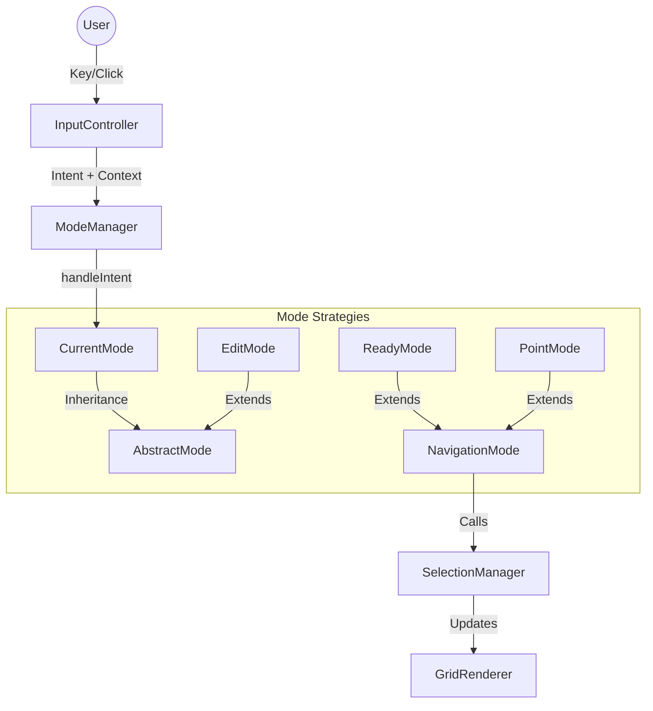

# Feature Spec: Centralized State & Input Management

- **Epic:** 902 (Architecture Refactor)
- **Status:** Draft / Ready for Implementation
- **Depends On:** Epic 901 (Spreadsheet Refactoring)

## 1\. Overview

The goal is to replace the application's fragmented state logic (scattered boolean flags like `isEditing`, `isDragging`) with a centralized **Finite State Machine (FSM)**. This system will decouple **Input Handling** (what the user presses) from **Application Behavior** (what happens), mediated by a "Mode" strategy.

This architecture explicitly prioritizes **code reuse**. Complex grid navigation logic (e.g., "Jump to Edge") is implemented exactly once and inherited by every mode that requires it (`ReadyMode`, `PointMode`, `EnterMode`), while modes that behave differently (`EditMode`) simply opt-out of that inheritance.

## 2\. Architecture: The "Intent" Pipeline

The system processes user interaction in three distinct stages:

1.  **Normalization (`InputController`):** Converts raw DOM events (keys, clicks) into semantic **Intents** (e.g., "NAVIGATE", "COMMIT").
2.  **Delegation (`ModeManager`):** Routes the Intent to the currently active **Mode Strategy**.
3.  **Execution (`ConcreteMode`):** The active Mode executes the specific logic, reusing base class behaviors where appropriate.

<!-- end list -->

## 3\. Core Components

### 3.1. `InputController` (The Gateway)

- **Responsibility:** The _only_ class in the application that attaches event listeners to the DOM (`window.keydown`, `grid.mousedown`).
- **Event Normalization:**
  - Maps `Ctrl` (Windows) and `Cmd` (Mac) to a unified `ctrl` property.
  - Prevents default browser behaviors (scrolling) when necessary.
- **Intent Mapping:** Converts inputs to abstract intents.
  - `ArrowUp` $\rightarrow$ `INTENT.NAVIGATE` (`direction: 'up'`)
  - `Cmd + ArrowUp` $\rightarrow$ `INTENT.NAVIGATE` (`direction: 'up'`, `ctrl: true`)
  - `Enter` $\rightarrow$ `INTENT.COMMIT`
  - `Escape` $\rightarrow$ `INTENT.CANCEL`
  - `A-Z, 0-9` $\rightarrow$ `INTENT.INPUT`

### 3.2. `ModeManager` (The State Container)

- **Responsibility:** Holds the single source of truth for `currentMode`.
- **API:**
  - `switchMode(modeName, context)`: Handles cleanup (`onExit`) of the old mode and initialization (`onEnter`) of the new one.
  - `handleIntent(intent, context)`: Delegates to `this.currentMode.handleIntent()`.
- **Dependencies:** holds references to `Spreadsheet`, `SelectionManager`, `EditorManager`, `HistoryManager` and passes them to Modes upon initialization.

---

## 4\. The Mode Strategy Hierarchy (Logic Reuse)

This hierarchy guarantees that navigation logic is written once and used everywhere.

### 4.1. `AbstractMode` (Base)

- **Role:** Interface definition.
- **Methods:** `onEnter()`, `onExit()`, `handleIntent()`.
- **Default Behavior:** Returns `false` for all intents (not handled).

### 4.2. `NavigationMode` (Shared Logic Layer)

- **Role:** The parent class for all modes that support Grid Navigation.
- **Extends:** `AbstractMode`
- **Implements `handleIntent('NAVIGATE')`:**
  - **Logic:**
    - Receives `direction`, `shift` (select), and `ctrl` (jump).
    - If `ctrl` is true $\rightarrow$ calls `this.selectionManager.jumpToEdge(direction, shift)`.
    - Else $\rightarrow$ calls `this.selectionManager.moveSelection(direction, shift)`.
- **Reuse Benefit:** Any mode extending this gets robust, complex navigation (edge jumping, range expansion) for free.

### 4.3. Concrete Modes

| Mode            | Parent           | Description & Specific Behaviors                                                                                                                                                                                                                                                                                                              |
| :-------------- | :--------------- | :-------------------------------------------------------------------------------------------------------------------------------------------------------------------------------------------------------------------------------------------------------------------------------------------------------------------------------------------- |
| **`ReadyMode`** | `NavigationMode` | **Idle State.** • Inherits Grid Navigation. • `INTENT.INPUT` (=) $\rightarrow$ Switch to `EditMode` (Formula). • `INTENT.INPUT` (Char) $\rightarrow$ Switch to `EditMode` (Std). • `INTENT.EDIT_START` (F2/DblClick) $\rightarrow$ Switch to `EditMode`.                                                                          |
| **`PointMode`** | `NavigationMode` | **Formula Building (Arrows move selection).** • Inherits Grid Navigation. • **Overrides** `onSelectionChanged` hooks (if implemented) or listens to selection events to update the Formula Builder. • `INTENT.INPUT` (Operator) $\rightarrow$ Commit ref, remain in Point Mode. • `INTENT.COMMIT` $\rightarrow$ Finalize formula. |
| **`EnterMode`** | `NavigationMode` | **Quick Entry (Typing over cell).** • Inherits Grid Navigation. • **Overrides** `handleIntent('NAVIGATE')`: First commits data to current cell, _then_ calls `super.handleIntent()` to move.                                                                                                                                            |
| **`EditMode`**  | `AbstractMode`   | **In-Cell Editing.** • Does **NOT** extend `NavigationMode`. • Ignores `Maps` intents (allows browser native text caret movement). • `INTENT.COMMIT` $\rightarrow$ Commits editor, switches to `ReadyMode`.                                                                                                                          |

---

## 5\. Stress Test Scenarios (Redundancy Check)

How the system handles the 4 scenarios from the prompt, demonstrating zero redundancy.

| Scenario                | Active Mode | Event Flow                                                                                                  | Logic Source            |
| :---------------------- | :---------- | :---------------------------------------------------------------------------------------------------------- | :---------------------- |
| **Arrow Right**         | `Ready`     | `Ready` delegates to `NavigationMode` $\rightarrow$ `selectionManager.moveSelection()`                      | `NavigationMode` (Base) |
| **Cmd + Right**         | `Point`     | `Point` delegates to `NavigationMode` $\rightarrow$ `selectionManager.jumpToEdge()`                         | `NavigationMode` (Base) |
| **Shift + Cmd + Right** | `Ready`     | `Ready` delegates to `NavigationMode` $\rightarrow$ `selectionManager.jumpToEdge(shift=true)`               | `NavigationMode` (Base) |
| **Shift + Right**       | `Edit`      | `Edit` (is `Abstract`) returns `false`. `InputController` allows default browser behavior (text selection). | Browser (Native)        |

**Conclusion:** Grid logic is coded _only_ in `NavigationMode` and `SelectionManager`. Text logic is "coded" by the browser/`EditorManager` and enabled by `EditMode` opting out of the navigation strategy.

---

## 6\. Implementation Plan

### Phase 1: Infrastructure

1.  **`js/ui/InputController.js`**: Implement DOM listener and Intent mapping logic.
2.  **`js/modes/ModeManager.js`**: Implement the mode switching and delegation loop.
3.  **`js/modes/AbstractMode.js`**: Create base class structure.

### Phase 2: Navigation Logic

1.  **Refactor `SelectionManager`**: Ensure `jumpToEdge` and `moveSelection` accept a `shift` boolean argument cleanly.
2.  **`js/modes/NavigationMode.js`**: Implement the `handleIntent('NAVIGATE')` method that calls `SelectionManager`.

### Phase 3: Concrete Modes

1.  **`js/modes/ReadyMode.js`**: Implement entry points to editing.
2.  **`js/modes/EditMode.js`**: Hook into `EditorManager` (start edit on enter, commit on exit).
3.  **`js/modes/EnterMode.js`**: Implement the "Overwrite and Move" logic.

### Phase 4: Integration

1.  **Update `Spreadsheet.js`**: Remove all manual event listeners (`keydown`, `click`). Instantiate `InputController` and `ModeManager`.
2.  **Verify**: Run existing E2E navigation tests. They should pass without modification if the logic is correctly replicated.

## 7\. Future Proofing

This architecture allows easy addition of:

- **`DragMode`**: Extends `AbstractMode`, handles mouse-move intents for drag-and-drop.
- **`ReadOnlyMode`**: Extends `NavigationMode`, but blocks all edits.
- **`MultiSheetSelectMode`**: For selecting ranges across tabs.

http://googleusercontent.com/immersive_entry_chip/0

export const INTENTS = {
NAVIGATE: 'NAVIGATE', // { direction: 'up', shift: bool, ctrl: bool }
EDIT_START: 'EDIT_START', // F2, Double Click
COMMIT: 'COMMIT', // Enter
CANCEL: 'CANCEL', // Esc
INPUT: 'INPUT', // Typing chars
DELETE: 'DELETE', // Backspace/Delete
UNDO: 'UNDO',
REDO: 'REDO',
SELECT_ALL: 'SELECT_ALL'
};

http://googleusercontent.com/immersive_entry_chip/1

import { AbstractMode } from './AbstractMode.js';
import { INTENTS } from '../ui/InputController.js';

export class NavigationMode extends AbstractMode {
handleIntent(intent, context) {
if (intent === INTENTS.NAVIGATE) {
const { direction, shift, ctrl } = context;

      if (ctrl) {
        // "Jump to Edge" logic reused for Ready, Point, and Enter modes
        this.selectionManager.jumpToEdge(direction, shift);
      } else {
        // Standard move logic reused
        this.selectionManager.moveSelection(direction, shift);
      }
      return true; // Signal that we handled it
    }
    return false;

}
}

http://googleusercontent.com/immersive_entry_chip/2
